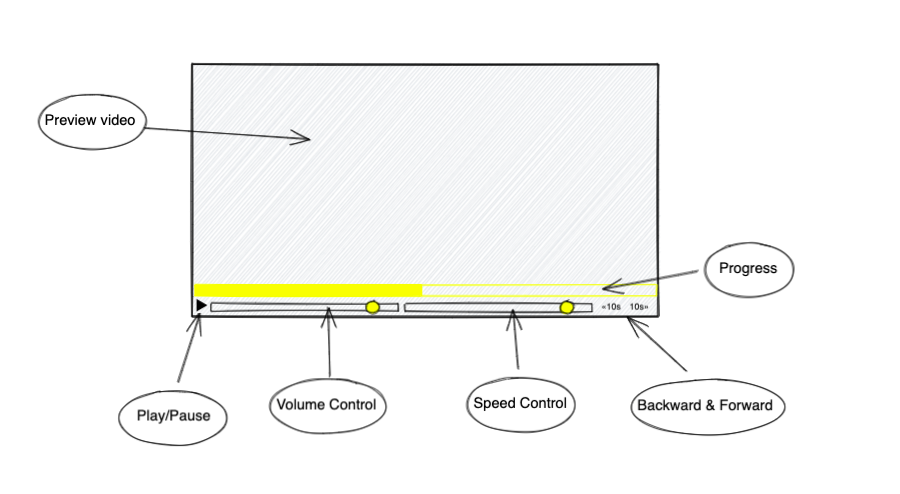

# Custom Video Player

This app is designed to play videos for the user. It is developed by a group of HackYourFuture students. The app comes with 5 main functions:
1. Play or Pause video
2. Volume Control
3. Playback Speed + Backlog
4. Progress Video
5. Backward, Forward control.

---

## User Story Dependencies

---

## WIREFRAME

---

## 0.Setup
- [ ] Create repo
- [ ] Add Contributors
- [ ] Set up Project Board
- [ ] Start README
- [ ] Turn on GitHub Pages

---

## 1. Initialize Application

> complete

As a user I want to open the web page so that I can use it

- [ ] _Given any browser when a user navigates to our URL then the site should appear with no errors_

### REPO

- This user story is developed on branch `_`.
- This branch is merged to `master` branch after the acceptance criteria have been checked off.

### Concern A : Play & Puase

- `play-puase.js`: This file will used for play and puase the video. In Handlers and Listeners folders the same file will use import and export.
This file is Anisya task.

### Concern B : Volume Control

- `play-puase.js`: This file is used to control the volume of the video. Chyngyz task.

### Concern C : Speed Control

- `play-puase.js`: This file is used to control the speed of the video. Houcinos task.

### Concern D : Backward & Forward

- `play-puase.js`: This file is used for backward or forward of the video. Mahmoud task.

### Concern E : Progress

- `progress.js`: This file will take care of the progress and how to control it. Sharaf task. 